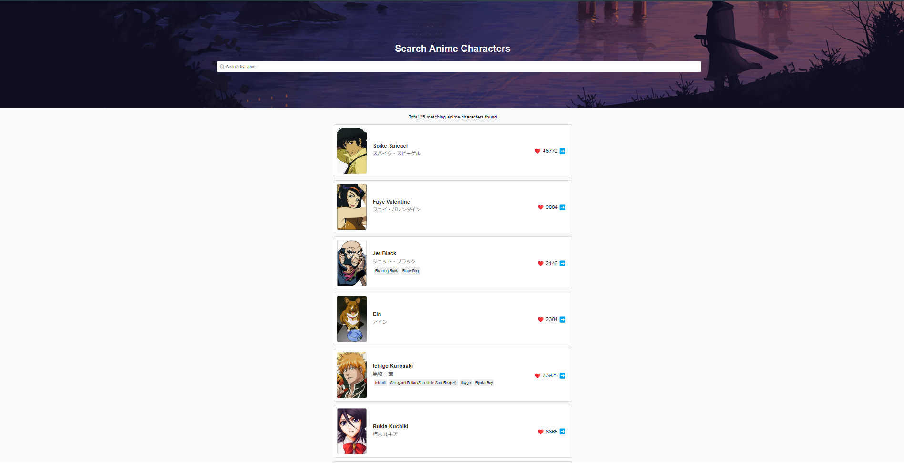
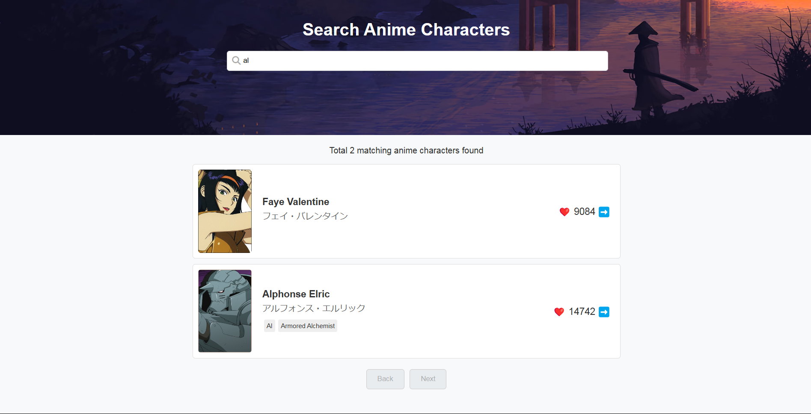
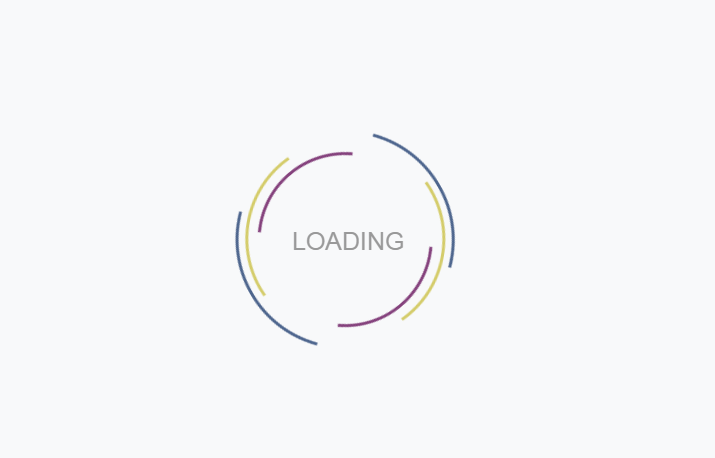
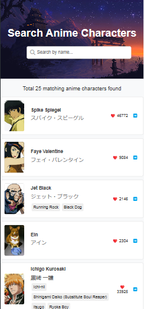

# Anime Characters

## Description

This repository contains the source code and assets for an Anime Characters application. The application allows users to explore various anime characters, search for specific characters, and access information about them.

## Screenshots

### Home Page

*Description: The home page provides users with an overview of the application and its features.*

### Search Page

*Description: Users can search for anime characters using the search bar.*

### Loading Page

*Description: The loading page appears while the app is fetching data or processing requests.*

### Mobile Page

*Description: The mobile view of the application allows users to access and interact with the features seamlessly on mobile devices.*

## Credits

**This project was created by Ayush Patel.**

